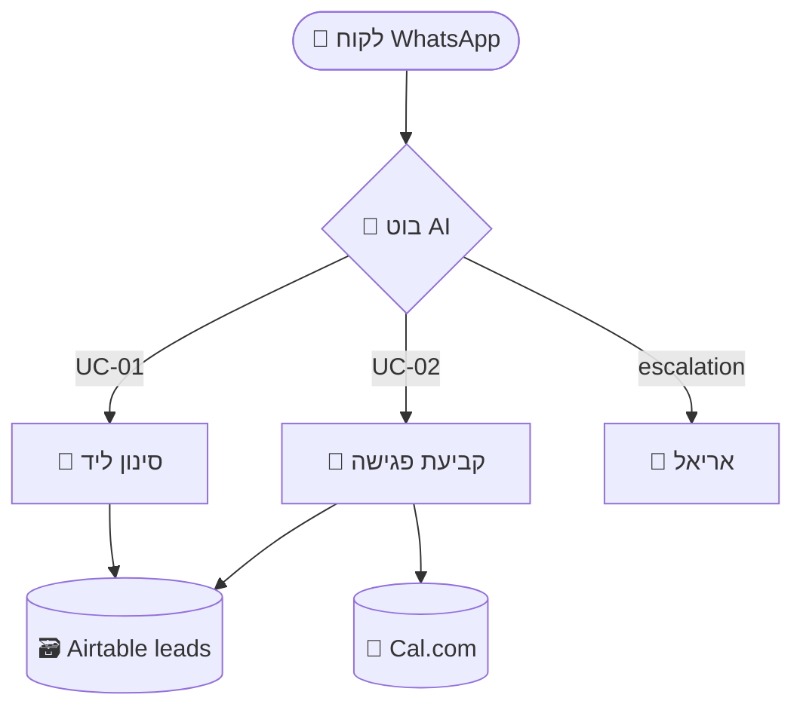

# Bot Spec — AutoWise AI

המטרה: להפוך Brief מאושר (או דרישות גולמיות) למסמך אפיון טכני אחד — **המקור היחיד לאמת** עבור כל שלבי הבנייה הבאים: flow, prompt, Make, QA, handover.

---

## When to use this skill

- ה-Brief של `client-discovery` אושר על ידי הלקוח ועוברים לבנייה
- הלקוח מספק דרישות גולמיות בלי גילוי מסודר (סמן זאת בפלט)
- צריך מסמך טכני שניתן לרפרר אליו לאורך כל הפיתוח
- ביטויים: "spec", "PRD", "אפיון בוט", "אפיון טכני", "מסמך דרישות"

## When NOT to use

- ל-Brief ראשוני ללקוח → `client-discovery`
- לעיצוב עץ שיחה → `conversation-flow`
- לכתיבת system prompt → `system-prompt`
- לתכנון תרחיש Make → `make-blueprint`

---

## Inputs

### חובה
- שירות מקטלוג AutoWise (אחד מ-6: chatbot-service / sales-agent / scheduling-bot / onboarding / payment-agent / insurance-agent)
- שם לקוח / שם פרויקט

### מומלץ (משפר משמעותית את הפלט)
- `discovery-brief-{client}.md` מאושר
- `meeting-summary-{client}.md`
- שם הבוט שהוחלט (אם כבר נקבע)
- שפה ראשית (ברירת מחדל: עברית)
- ערוצים סופיים שנבחרו

---

## AutoWise default stack

ברירות מחדל. השתמש בהן אלא אם הלקוח דרש משהו אחר במפורש.

| שכבה | ברירת מחדל | חלופות מקובלות |
|---|---|---|
| ערוץ ראשי | WhatsApp Business API (360dialog / GreenAPI) | אתר / Instagram / Voice |
| תזמור (orchestration) | Make.com | n8n |
| מסד נתונים | Airtable | Google Sheets / Supabase |
| טפסים | Fillout | Tally |
| יומן | Cal.com / Google Calendar | Calendly |
| סליקה | Stripe / PayPal | Bit / Paybox |
| AI | Anthropic Claude / OpenAI | Gemini |
| Voice (אם צריך) | ElevenLabs | — |

---

## Israeli locale defaults (must specify in every spec)

לכל פרויקט, האפיון חייב לקבוע את ההגדרות האלה במפורש:

| פרמטר | ברירת מחדל |
|---|---|
| שפה | עברית RTL |
| פורמט טלפון | `+972XXXXXXXXX`; קבלה גם של `05X-XXXXXXX` ונרמול אוטומטי |
| פורמט תאריך | `DD/MM/YYYY` |
| מטבע | ILS (₪) |
| אזור זמן | `Asia/Jerusalem` |
| ימי עבודה | א'-ה'; יום ו' חלקי; מודעות לחגים יהודיים |
| שעות פעילות | להגדיר בכל פרויקט (ברירת מחדל: 09:00-18:00) |

---

## Process

### Step 1 — Validate inputs
- אם יש Brief מאושר → קרא וחלץ: שירות, אינטגרציות, KPIs, מה לא בסקופ
- אם אין Brief → סמן באדום בראש המסמך: ⚠️ *"אפיון נכתב ללא discovery מאושר — הנחות מסומנות כ-(?). יש לאמת לפני בנייה."*

### Step 2 — Define personas
1-3 personas של מי שמתקשר עם הבוט. לכל אחד:
- שם persona (למשל: "ליד חם", "לקוח קיים", "פניה לא רלוונטית")
- מה הוא רוצה
- במה הוא שונה מה-personas האחרות

### Step 3 — Map Use Cases
חלק את כל ההתנהגויות ל-Use Cases ממוספרים:
- IDs קבועים: `UC-01`, `UC-02`, ... (אנגלית, נשארים זהים לאורך הפרויקט)
- כל UC: trigger → outcome → 1 שורת happy path → 1-2 edge cases
- **3-7 Use Cases ב-MVP**. יותר מזה — חלק לפאזות (MVP / Phase 2 / Future)

### Step 4 — Design data model
- **Airtable tables:** שם טבלה, רשימת שדות (שם, type, required, default)
- **Fillout fields** (אם רלוונטי): שם, type, validation
- כל שדה יקבל ID באנגלית קצרה (`lead_status`, `appointment_dt`, `payment_amount`)

### Step 5 — Build integrations diagram
Mermaid `flowchart TD`. תוויות עברית, IDs אנגלית.

### Step 6 — Define AI tools / functions
לכל יכולת שדורשת function calling או webhook חיצוני:
- `name` (אנגלית, snake_case)
- `description` (עברית, משפט אחד)
- `parameters` (JSON Schema קצר)
- *מתי* הבוט קורא לזה
- *מה* הוא עושה עם התוצאה

### Step 7 — Compile the spec doc
פלט אחד: `bot-spec-{client-slug}-v{N}-{YYYY-MM-DD}.md`. מבנה חובה למטה.

---

## Output — `bot-spec-{client-slug}-v{N}-{YYYY-MM-DD}.md`

````markdown
# {שם הבוט} — אפיון טכני
*AutoWise AI · {שם לקוח} · גרסה {N} · {תאריך}*

> **סטטוס:** Draft / Approved / In Build / Live
> **מבוסס על:** discovery-brief-{client}-{date}.md
> **שירות מקטלוג:** {chatbot-service / sales-agent / ...}
> **שפה ראשית:** עברית RTL · אזור זמן: Asia/Jerusalem · מטבע: ₪

---

## 1. סקירה במשפט אחד
{מה הבוט עושה, למי, ובאיזה ערוץ — שורה אחת}

## 2. Personas

### P1 — {שם}
- **רוצה:** ...
- **מאיפה הגיע:** ...
- **שונה מאחרים בכך ש:** ...

### P2 — {שם}
...

## 3. Use Cases (MVP)

### UC-01 — {שם בעברית}
- **Trigger:** {מי / מה / מתי}
- **Outcome:** {מה קורה אחרי}
- **Happy path (שורה אחת):** ...
- **Edge cases:**
  - ...
  - ...

### UC-02 — {שם}
...

## 4. Conversation scope

### בתוך הסקופ
- ...

### מחוץ לסקופ (הבוט לא יעשה)
- ...

### Handoff conditions (העברה לאדם)
1. הלקוח אמר "תן לי לדבר עם בן אדם" / "אריאל" / "נציג"
2. הבוט לא הצליח להבין 3 הודעות ברצף
3. UC רגיש (תלונה / סוגיה כספית מורכבת / אובדן מידע)
4. {ספציפי לפרויקט}

## 5. Data model

### Airtable: `{table_name}`
| שדה | ID | Type | Required | הערות |
|---|---|---|---|---|
| שם מלא | `full_name` | Single line text | ✅ | |
| טלפון | `phone_e164` | Phone | ✅ | normalized to +972 |
| סטטוס | `status` | Single select | ✅ | new/qualified/booked/lost |
| ... | ... | ... | ... | ... |

### Fillout form: `{form_name}`
| שדה | ID | Type | Required | Validation |
|---|---|---|---|---|
| ... | ... | ... | ... | ... |

## 6. Integrations diagram



## 7. AI tools / functions

### `book_appointment`
**עברית:** קובע פגישה ביומן בזמן שהלקוח ביקש.

**Parameters:**
```json
{
  "phone": "string (E.164)",
  "datetime": "string (ISO 8601, Asia/Jerusalem)",
  "service_type": "enum: consultation | demo | follow_up",
  "notes": "string (optional, free text)"
}
```

**מתי קוראים:** UC-02, אחרי שהלקוח אישר זמן ספציפי
**מה עושים עם התוצאה:** שולחים ללקוח אישור עם פרטי הפגישה ולינק לביטול

### `qualify_lead`
...

## 8. Success metrics (KPIs)

| מדד | יעד | מקור מדידה |
|---|---|---|
| זמן תגובה ראשונה | < 30 שניות | Make logs |
| % לידים שעוברים סינון | ≥ 60% | Airtable status field |
| % פגישות שנקבעות מתוך לידים בשלים | ≥ 40% | Cal.com + Airtable |
| ... | ... | ... |

## 9. Edge cases & failure modes

| מקרה | מה קורה היום | מה הבוט צריך לעשות |
|---|---|---|
| API של WhatsApp נופל | אין מענה | Make retry + התראה לאריאל |
| הלקוח שולח קובץ קול | התעלמות | מענה: "כרגע אני עונה רק על טקסט, מעביר לאריאל" |
| הלקוח מנהל שיחה ב-2 שפות | בלבול | זיהוי שפה ראשונה והיצמדות אליה |
| ... | ... | ... |

## 10. Out of scope (חתום)

הצהרה מפורשת — מונע scope creep:
- ...
- ...
- ...

## 11. Effort estimate

| שלב | ימים | תלוי ב |
|---|---|---|
| **הבנה** (סופית, לאחר אישור) | 1-2 | אישור הלקוח |
| **בנייה** | 5-10 | חיבור WhatsApp + CRM |
| **הפעלה ובדיקות** | 2-3 | זמינות לקוחות לבדיקה |
| **שיפור (חודש שוטף)** | — | בעת הפעלה |
| **סה״כ ל-Go-Live** | **8-15 ימי עבודה** | |

## 12. Open questions (לפני תחילת בנייה)

- [ ] {שאלה 1}
- [ ] {שאלה 2}
- [ ] {שאלה 3}

---

*אפיון זה הוא המקור לאמת. כל שינוי חייב לעבור דרך עדכון גרסה (v{N+1}) עם תאריך.*
````

---

## Tone & language rules

- **שפה במסמך:** עברית בעיקר. אנגלית רק ל-IDs (`UC-01`, `lead_status`), שמות טבלאות, וטרמינולוגיה טכנית (Airtable, WhatsApp API)
- **טון:** טכני-עסקי, לא שיווקי. אפיון נקרא על ידי מי שיבנה את הבוט (אריאל / מפתח חיצוני)
- **קונקרטיות לפני אלגנטיות:** עדיף "טבלת `leads` עם 8 שדות" על "מסד נתונים מקיף ללידים"
- **כל הנחה מסומנת:** השתמש בסימן `(?)` ליד כל שדה / מספר / לוגיקה שלא אומתה בגילוי

---

## Cross-skill behavior

- בסיום הסקיל, הצע: *"האפיון מוכן. הצעדים הבאים:*
  1. *להריץ `conversation-flow` לכל UC במקביל*
  2. *להריץ `system-prompt` ליצירת prompt מבוסס על הפרסונות והכלים*
  3. *להריץ `make-blueprint` לתכנון התרחיש לפני בנייה ב-Make*"
- אם זה לקוח חדש לחלוטין ואין discovery — סרב להמשיך ובקש להריץ קודם `client-discovery`
- אם השירות מהקטלוג לא ברור — שאל לפני שמתחילים אפיון

---

## File structure

```
bot-spec/
├── SKILL.md                              # זה הקובץ הזה
├── templates/
│   ├── spec-base.md                      # מבנה האפיון
│   ├── service-defaults/
│   │   ├── chatbot-service.md            # ברירות מחדל לכל אחד מ-6
│   │   ├── sales-agent.md
│   │   ├── scheduling-bot.md
│   │   ├── onboarding.md
│   │   ├── payment-agent.md
│   │   └── insurance-agent.md
│   └── airtable-schemas/
│       ├── leads-base.md
│       ├── appointments-base.md
│       └── payments-base.md
└── examples/
    ├── financial-house-2025-01/          # מבוסס בית פיננסי למשפחה
    └── shay-ovadia-2025-02/              # מבוסס שי עובדיה
```

---

## Service-specific defaults (highlights)

לכל שירות מהקטלוג, יש ברירות מחדל ב-`templates/service-defaults/`. דוגמאות:

**`chatbot-service`** — אפיון תמיד יכלול: זיהוי intent, FAQ list, fallback ל-handoff, log לכל שיחה ב-Airtable.

**`sales-agent`** — אפיון תמיד יכלול: 3-5 שאלות סינון, מחירון/הצעת מחיר אוטומטית, טיפול ב-3 התנגדויות נפוצות, סגירה לפגישה.

**`scheduling-bot`** — אפיון תמיד יכלול: זיהוי סוג שירות, בדיקת זמינות, אישור כפול, תזכורת 24 שעות לפני, ביטול עצמי.

**`onboarding`** — אפיון תמיד יכלול: רצף Fillout (פרטים → חוזה → סליקה), שמירה ל-Airtable, התראה לאריאל בסיום, ולקוח מקבל סרטון פתיחה.

**`payment-agent`** — אפיון תמיד יכלול: סנכרון חובות מ-CRM, נוסחי תזכורת בעלייה (1/3/7 ימים), קישור סליקה אישי, זיהוי תשלום וסגירת חוב.

**`insurance-agent`** — אפיון תמיד יכלול: רגולציה (אישור עיבוד נתונים), חיבור CRM של סוכנות, טופס דיגיטלי לפתיחת קופ״ג, חתימה דיגיטלית.
