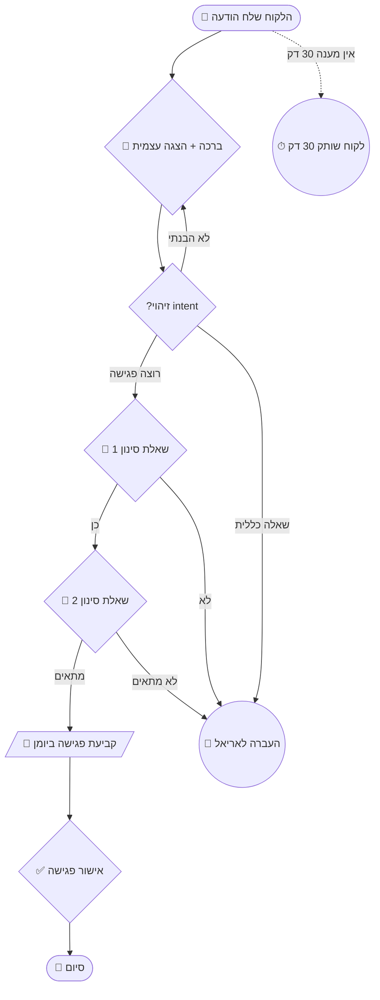

# Conversation Flow — AutoWise AI

המטרה: לתכנן את העץ הביצועי של השיחה — מה הבוט אומר בכל צומת, מתי הוא מסתעף, איך הוא נופל בחזרה, ומתי הוא מעביר לאריאל.

---

## When to use this skill

- יש Use Case מ-`bot-spec` שצריך לתכנן בפועל
- מתכננים בוט חדש ועוד אין flow ברור
- ביטויים: "flow", "עץ שיחה", "תכנון שיחה", "מה הבוט אומר אם...", "decision tree"
- הלקוח שלח דוגמת שיחה ורוצים להפוך לזרימה ניתנת לבנייה

## When NOT to use

- לאפיון טכני מלא → `bot-spec`
- לכתיבת system prompt עם persona ו-constraints → `system-prompt`
- לתכנון תרחיש Make.com → `make-blueprint`
- ל-QA → `bot-qa`

---

## Inputs

### חובה
- Use Case אחד או יותר (מתוך `bot-spec` עם IDs כמו UC-01)
- שם הבוט / שירות מהקטלוג

### מומלץ
- `bot-spec-{client}.md` המלא
- דוגמאות שיחה אמיתיות (סקרינשוטים מתומללים מהלקוח)
- שפת הלקוחות (פורמלי / ידידותי / "סבבה")

---

## Core flow patterns by AutoWise service

לכל שירות מהקטלוג, יש pattern בסיסי שכל flow צריך להיבנות סביבו:

### `chatbot-service` — תבנית **Triage + Resolve**
```
ברכה → זיהוי intent →
  ├─ FAQ מוכר → תשובה ישירה → "עזרתי?"
  ├─ דורש מידע → איסוף 1-2 שדות → תשובה
  └─ לא הבנתי / מורכב → handoff
```

### `sales-agent` — תבנית **Qualify → Pitch → Close**
```
ברכה → 3 שאלות סינון →
  ├─ ליד חם → הצעת ערך מותאמת → קביעת פגישה / שליחת מחירון
  ├─ ליד פושר → שליחת תוכן (סרטון/מדריך) → follow-up בעוד יומיים
  └─ לא רלוונטי → תודה מנומסת + שמירה בנפרד
```

### `scheduling-bot` — תבנית **Service → Slot → Confirm**
```
ברכה → סוג שירות → בדיקת זמינות →
הצעת 2-3 חלונות → אישור →
איסוף פרטים → אישור כפול →
תזכורת 24h לפני
```

### `onboarding` — תבנית **Linear with checkpoints**
```
ברוך הבא → סרטון פתיחה →
טופס פרטים (Fillout) → חוזה →
סליקה → קביעת פגישת kickoff →
שליחת מסמכים
```

### `payment-agent` — תבנית **Escalating reminders**
```
תזכורת רכה (יום 1) →
תזכורת ישירה (יום 3) →
שיחה אישית (יום 7) →
escalation לאריאל (יום 14)
```
*בכל שלב: לינק סליקה ישיר. זיהוי תשלום → סגירת flow.*

### `insurance-agent` — תבנית **Compliance-gated**
```
ברכה → אישור עיבוד נתונים →
זיהוי צורך → איסוף נתונים מובנה →
טופס דיגיטלי → חתימה →
אישור לסוכן + לקוח
```

---

## Process

### Step 1 — Pick the pattern
זיהה את ה-pattern על בסיס השירות. אם יש pattern גנרי שמתאים — התחל ממנו והתאם.

### Step 2 — Map nodes
לכל UC, מפה את הצמתים. לכל צומת:
- **ID באנגלית** (snake_case): `greet`, `qualify_q1`, `book_slot`, `handoff`
- **תוויות בעברית** ב-Mermaid
- **סוג צומת:** `message` / `question` / `decision` / `function_call` / `terminal`

### Step 3 — Write example messages
לכל צומת מסוג `message` או `question`, כתוב את **הניסוח המדויק שהבוט יגיד**. זה הקלט הקריטי ל-`system-prompt`.

### Step 4 — Build Mermaid diagram
`flowchart TD`. הכלל הקבוע:
- **Node IDs באנגלית** (Mermaid לא נקי עם RTL)
- **תוויות בעברית** בתוך הצמתים
- **משתמש = `[(...)]`**, **בוט = `{...}`**, **החלטה = `{?...}`**, **function = `[/...\\]`**, **handoff = `((...))`**

### Step 5 — Fallback matrix
טבלה עבור 4 כשלים אופייניים: לא הבנתי / משתמש שותק / API נופל / כפילויות.

### Step 6 — Handoff conditions
תנאים מדויקים מתי הבוט מפסיק וקורא לאריאל. כל תנאי = משפט אחד ספציפי.

### Step 7 — Function call mapping
לכל function call ב-flow: שם, מתי קוראים, אילו פרמטרים, מה עושים עם החזרה.

---

## Output — `flow-{client-slug}-{uc-id}-{YYYY-MM-DD}.md`

````markdown
# Flow: {שם UC} ({UC-ID})
*{שם לקוח} · {שם בוט} · {תאריך}*

> **Pattern:** {Triage+Resolve / Qualify→Pitch→Close / ...}
> **קלט:** UC-XX מ-bot-spec-{client}-v{N}.md
> **ערוץ:** WhatsApp Business

---

## 1. סקירה במשפט אחד
{מה ה-flow הזה משיג, ובאיזה רגע בשיחה הוא מתחיל}

## 2. Mermaid diagram



## 3. Node-by-node breakdown

### `greet` — ברכה והצגה
- **סוג:** message
- **טריגר:** הודעה ראשונה מהלקוח
- **ניסוח (עברית):**
  > היי! 👋 אני {שם הבוט}, הסוכן החכם של {שם העסק}.
  > אני אעזור לך {מטרת הבוט בשורה אחת}.
  > איך אוכל לעזור?
- **כללים:**
  - הצגה פעם אחת בלבד בכל השיחה
  - 2-3 שורות מקסימום
  - אמוג'י אחד מקסימום

### `intent` — זיהוי כוונה
- **סוג:** decision (AI-driven)
- **קלט:** ההודעה הראשונה של הלקוח
- **פלט אפשרי:** `book_meeting` / `general_question` / `unclear`
- **לוגיקה:** function call → `classify_intent`

### `q1` — שאלת סינון 1
- **סוג:** question
- **ניסוח:**
  > מעולה! 🎯 לפני שאני בודק לך זמינות, שאלה אחת:
  > **{השאלה הספציפית מהאפיון}**?
- **תשובות צפויות:** "כן" / "לא" / טקסט חופשי שצריך לפרש
- **fallback אם לא ברור:** הצע 2 כפתורים (כן/לא)

### `book` — קביעת פגישה
- **סוג:** function_call
- **שם:** `book_appointment`
- **קלט:**
```json
  {
    "phone": "auto-from-context",
    "datetime": "from-user-input",
    "service_type": "consultation"
  }
```
- **טיפול בכשל:** הצע 2 חלונות חלופיים מ-Cal.com
- **הודעה אחרי הצלחה:**
  > מעולה! ✅ הפגישה נקבעה ל-**{תאריך} בשעה {שעה}**.
  > שלחתי הזמנה לקלנדר. נתראה!

(... המשך לכל צומת ...)

## 4. Fallback matrix

| מצב | מה הבוט עושה | אחרי כמה ניסיונות עוברים ל-handoff |
|---|---|---|
| לא הבנתי את התשובה | "סליחה, לא הבנתי. תוכל לנסח אחרת?" | אחרי 2 ניסיונות |
| הלקוח שותק 5 דקות | "עדיין כאן? 🙂" | אחרי 30 דקות שתיקה |
| API של Cal.com נופל | "רגע אחד, יש עומס. אני מנסה שוב..." (retry x2) | אחרי 2 retries |
| הלקוח שולח קובץ קול / וידאו | "כרגע אני עונה רק על טקסט. אני מעביר לאריאל." | מיידי |
| הלקוח שולח טקסט בלועזית מורכבת | היצמדות לעברית, בקשה לחזור בעברית | אחרי הודעה אחת |

## 5. Handoff conditions

הבוט מפסיק וקורא לאריאל **באופן מיידי** כש:

1. הלקוח אמר "תן לי לדבר עם בן אדם" / "אריאל" / "נציג" / "תעבירו אותי"
2. הלקוח כתב 3 הודעות שהבוט לא הצליח לפרש (intent = `unclear` × 3)
3. הלקוח התלונן (זיהוי מילים: "לא מרוצה", "לא עובד", "טעות", "כעוס")
4. סוגיה כספית מורכבת (החזר, ויכוח על חיוב)
5. {ספציפי לפרויקט — הוסף כאן}

**איך handoff עובד בפועל:**
1. הבוט שולח: *"אני מעביר אותך לאריאל. הוא יחזור אליך תוך {X זמן}. רגע."*
2. Make יוצר התראה לוואטסאפ של אריאל עם:
   - שם הלקוח + טלפון
   - 5 ההודעות האחרונות בשיחה
   - סיבת ה-handoff
3. הסטטוס ב-Airtable משתנה ל-`needs_human`

## 6. Function call mapping

| Function | מתי קוראים (Node ID) | פרמטרים | מה עושים עם התוצאה |
|---|---|---|---|
| `classify_intent` | `intent` | message text | מסלול הסתעפות |
| `check_availability` | לפני `book` | date_range | מציג 2-3 חלונות |
| `book_appointment` | `book` | phone, datetime, type | אישור או נסיון נוסף |
| `log_to_airtable` | בסוף כל UC | full conversation | תיעוד |

## 7. Example happy path conversation

> דוגמה מלאה של שיחה הולכת חלק. שימושי ל-`bot-qa` ול-`system-prompt`.

```
👤 לקוח: היי, ראיתי את הסרטון שלכם בטיקטוק
🤖 בוט: היי! 👋 אני REG, הסוכן החכם של חכמת האוטומציה.
       אני אעזור לך להבין אם אוטומציה מתאימה לעסק שלך.
       איך אוכל לעזור?
👤 לקוח: רוצה לקבוע פגישה
🤖 בוט: מעולה! 🎯 לפני שאני בודק זמינות, שאלה אחת:
       האם יש לך עסק עם לפחות 30 לידים בחודש?
👤 לקוח: כן בערך 50
🤖 בוט: יופי. מתי יותר נוח לך — בוקר או אחה"צ?
👤 לקוח: אחה"צ
🤖 בוט: יש לי 2 חלונות פנויים השבוע:
       📅 יום ג' 14:00
       📅 יום ה' 16:30
       מה מתאים?
👤 לקוח: יום ה'
🤖 בוט: מעולה! ✅ הפגישה נקבעה ל-יום חמישי בשעה 16:30.
       שלחתי הזמנה לקלנדר. נתראה!
```

## 8. Example edge case

```
👤 לקוח: אני צריך לדבר עם המנהל
🤖 בוט: בטח. אני מעביר אותך לאריאל.
       הוא יחזור אליך תוך שעה. רגע.
[Make → התראה לוואטסאפ של אריאל]
[Airtable: status = needs_human]
```
````

---

## WhatsApp messaging rules (חובה ב-flow)

| כלל | פירוט |
|---|---|
| **אורך הודעה** | ≤ 4 שורות. אם ארוך יותר — פצל לכמה הודעות. |
| **אמוג'י** | 0-1 לכל הודעה. בתחילה או בסוף, לא באמצע. |
| **בולד** | `*טקסט*` (סינטקס WhatsApp), שמור לדגשים אמיתיים. |
| **רשימות** | מקסימום 3 פריטים. יותר — חלק להודעות. |
| **כפתורים (interactive)** | רק אם הלקוח חיבר WhatsApp Business API מלא. אחרת — מספרים (1/2/3). |
| **קישורים** | תמיד עטוף בהקשר: ❌ "tinyurl.com/xyz" ✅ "לתשלום: tinyurl.com/xyz" |
| **שעות** | פורמט 24h ("16:30"), לא AM/PM. |
| **מספרי טלפון** | תמיד +972 או 05X — אף פעם 972 בלי + |
| **חיכוי** | בין הודעות עוקבות מהבוט: 1-2 שניות (מרגיש אנושי) |

---

## Cross-skill behavior

- בסיום, הצע: *"ה-flow מוכן. הצעדים הבאים:*
  1. *להריץ `system-prompt` כדי להפוך את הצמתים ל-prompt עובד*
  2. *להריץ `make-blueprint` למיפוי הצמתים למודולים ב-Make*
  3. *להריץ `bot-qa` לבניית checklist בדיקות מבוסס על ה-happy path וה-edge cases*"
- אם ה-UC לא קיים ב-`bot-spec` — סרב והפנה ל-`bot-spec` קודם
- אם יש כמה UCs — שאל אם לעשות קובץ אחד או קובץ ל-UC. ברירת מחדל: קובץ ל-UC

---

## File structure

```
conversation-flow/
├── SKILL.md
├── templates/
│   ├── flow-base.md
│   ├── patterns/
│   │   ├── triage-resolve.md            # chatbot-service
│   │   ├── qualify-pitch-close.md       # sales-agent
│   │   ├── service-slot-confirm.md      # scheduling-bot
│   │   ├── linear-onboarding.md         # onboarding
│   │   ├── escalating-reminders.md      # payment-agent
│   │   └── compliance-gated.md          # insurance-agent
│   └── messages/
│       ├── greetings.md                 # 5 וריאנטים של ברכות פתיחה
│       ├── handoffs.md                  # נוסחי handoff
│       ├── fallbacks.md                 # נוסחי fallback
│       └── confirmations.md             # נוסחי אישור
└── examples/
    ├── financial-house-uc01-2025-01/    # פתיחת קופ"ג בית פיננסי
    └── shay-ovadia-uc01-2025-02/        # מיני-קורס שי עובדיה
```

---

## ⚠️ Anti-patterns (אסור ב-flow ש-AutoWise בונה)

- ❌ לולאות אינסופיות בלי escape hatch ל-handoff
- ❌ "אני לא יכול לעזור עם זה" בלי הצעה חלופית
- ❌ הודעת ברכה ארוכה משלוש שורות
- ❌ יותר מ-3 שאלות סינון רצופות בלי משוב חיובי לאמצע
- ❌ אמוג'י בכל הודעה (מרגיש זול)
- ❌ "סליחה" יותר מפעם אחת בשיחה
- ❌ צמתים בלי fallback (מסכן לולאה)
- ❌ function call בלי טיפול ב-failure
