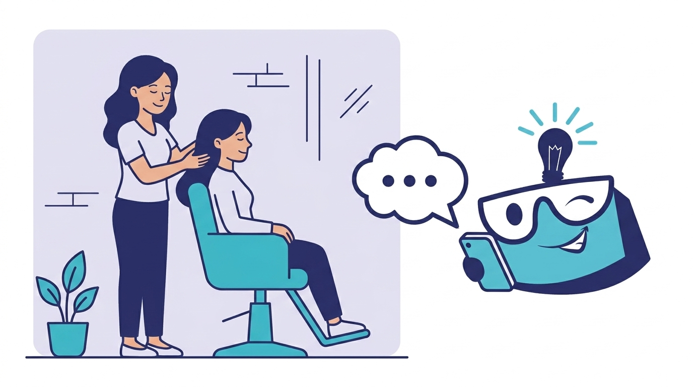

# להפסיק להתנצל על אוטומציה — זה לא פחות אישי, זה יותר אישי

*בזמן שאת מתמקדת בלקוחה שמולך — האוטומציה ממשיכה לתפוס לקוחות חדשים. זה לא הפחות אישי שלך. זה היותר אישי שלא הכרת.*

> "אני מעדיפה לענות בעצמי. הלקוחות שלי רוצים אותי, לא בוט."

אם זה המשפט שאת אומרת ללקוחות שלך, או חוזרת עליו בראש כדי להצדיק שעוד לא הטמעת אוטומציה — בואי נדבר רגע.

זה לא יותר טוב. זה רק יותר עייף.

## "אישי" — מילה שאיבדה את המשמעות שלה

מה זה "אישי" אצל בעלת סלון יופי ב-2026? היא עונה לוואטסאפ בערב כשהיא מסיימת לעבוד עם לקוחה. מאוחר. עייפה. בקצרה. הלקוחה הבאה שכתבה לה ב-22:00 מקבלת תגובה ב-23:30:

> "היי! אני אחזור אלייך מחר 🙏"

למחרת — הלקוחה כבר אצל המתחרה. כי בזמן שאת ישנת, היא קיבלה הצעה ספציפית מסלון אחר עם זמינות מיידית.

זה לא אישי. זה מקוטע, מפוזר, ועייף.

ה"אישי" של פעם — שיחת טלפון של 10 דקות, יחס, פגישה — מת ברגע שכל לקוח מצפה לתגובה תוך דקה. אי אפשר להיות גם אישי, גם מהיר, גם זמין 24/7. אחד משלושת אלה תמיד נופל. אצל 99% מבעלי המקצוע — מה שנופל זה האישי.

## איך "אישי" נראה ב-2026

אישי כיום הוא לא **מי** עונה. אישי הוא **כמה זה רלוונטי, באיזו מהירות, ובאיזה מצב רוח**.

לקוחה שמקבלת תוך 30 שניות תשובה ספציפית — "הטיפול שאת רוצה — 90 דקות, ₪450, יש מקום ביום ה' ב-16:00 או יום ו' ב-10:30?" — מרגישה אישית **יותר** מלקוחה שמחכה 14 שעות לקבל "אעדכן אותך מחר".

ה"אדם האמיתי" שעונה לה למחרת בעייפות, מפוזר בין שבע שיחות אחרות, לא נותן לה יחס. הוא נותן לה **שאריות תשומת לב**.

## שלושה דברים שאוטומציה עושה אישי יותר ממך

**1. היא זוכרת את ההיסטוריה.** הבוט יודע שהלקוחה הייתה אצלך לפני שישה שבועות לטיפול X, אוהבת שהמסאז' חם, ושהיא רגישה ללבנדר. אתה? אם אתה זוכר, זה רק כי רשמת לעצמך פתק. הבוט לא צריך פתק.

**2. היא זמינה כשהלקוחה צריכה אותך, לא כשנוח לך.** ב-22:30 כשהיא מתעוררת מתינוקת ונזכרת שהיא צריכה לקבוע — היא מקבלת מענה מיידי. בעיניה, זה אישי. "הם תמיד שם בשבילי."

**3. היא לא משעממת אותה עם דברים אדמיניסטרטיביים.** הזמן שלך עם לקוחה יקר. הבוט מטפל ב"מתי, כמה, איפה, מה נשאר במלאי". אתה מטפל ב**מה שבאמת אישי** — להסתכל לה בעיניים, להקשיב, לעשות עבודה טובה.

## מה ההתנגדות באמת אומרת

ההתנגדות הגדולה לאוטומציה היא הפחד שלקוחות "ירגישו שלא אכפת לך". האמת הפוכה. בלי אוטומציה, הם **כבר** מרגישים שלא אכפת לך. אתה פשוט עסוק מדי כדי לראות את זה.

הם לא אומרים את זה לפנים. הם פשוט בוחרים את הסלון הבא.

## להפסיק להתנצל

אוטומציה לא מחליפה את ה"אישי" שלך. היא משחררת אותו לחזור להיות אישי באמת. במקום שיחת ערב שטוחה של "אעדכן אותך מחר", המגע הבא שלך עם הלקוחה יהיה הטיפול עצמו — עם נוכחות, עם חיוך, בלי טלפון בכיס שמרטט.

זה לא פחות אישי. זה הרבה יותר.

---

*חכמת האוטומציה · בוטים אוטומטיים מבוססי AI לעסקי שירות בישראל · [autowise-ai.org](https://autowise-ai.org)*
